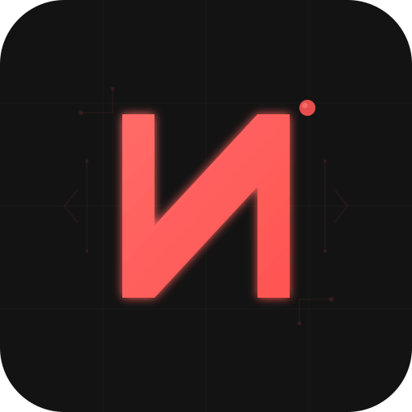

<p align="center">
  
</p>

<h1 align="center">Noxen</h1>

<p align="center">
  <strong>AI agent that transforms existing codebases — no migrations, no rewrites, directly on production code.</strong>
</p>

<p align="center">
  <a href="https://app.noxen.ai">Cloud</a> &middot;
  <a href="https://noxen.ai">Website</a> &middot;
  <a href="https://github.com/noxen-ai/noxen/issues">Issues</a> &middot;
  <a href="https://github.com/noxen-ai/noxen/discussions">Discussions</a>
</p>

---

Noxen understands your codebase, researches best practices, plans improvements, and implements them — with your approval at every step. **You own the code. You own the API keys. Noxen provides the intelligence.**

## Features

- **Spider Analysis** — Deep codebase scanning: languages, frameworks, services, dependency graphs, complexity metrics
- **Research Agent** — Autonomous discovery of best practices, patterns and solutions for your stack via GitHub, Exa, Firecrawl
- **Board Deliberation** — Multiple LLMs analyze your question independently, review each other's answers, then a chairman synthesizes the final response
- **Execution Engine** — Approved plans are executed via Claude Code in isolated sandboxes with rollback support
- **Skill System** — Auto-generated reusable skills from research, with confidence scoring and version control
- **Knowledge Base** — Qdrant-powered semantic search across all indexed codebases
- **Notifications** — Telegram, Slack, Google Chat, Email alerts for approvals and completions
- **Web Dashboard** — Real-time monitoring, chat, research, skill browser, execution viewer

## Architecture

```
                        ┌───────────────────┐
                        │   Web Dashboard   │
                        │   (localhost:8400) │
                        └────────┬──────────┘
                                 │
                  ┌──────────────┼──────────────┐
                  │        FastAPI Server        │
                  │       (Orchestrator)         │
                  └──┬────┬────┬────┬────┬──────┘
                     │    │    │    │    │
             ┌───────┘  ┌─┘  ┌─┘  ┌─┘  └───────┐
             │ Board │  │Chat│ │Exec│ │Research│
             │(Multi │  │SSE │ │Eng │ │ Agent  │
             │ LLM)  │  └────┘ └────┘ └───┬────┘
             └──┬────┘                     │
                │                    ┌─────┴─────┐
        ┌───────┼───────┐            │   Qdrant   │
       GPT   Claude   Gemini        │ (VectorDB) │
        │       │       │           └───────────┘
       Ollama  Grok  DeepSeek
```

## Quick Start

```bash
git clone https://github.com/noxen-ai/noxen
cd noxen
cp .env.example .env
# Add at least one LLM API key in .env
docker compose up -d
open http://localhost:8400
```

## Requirements

- Docker and Docker Compose
- Internet connection (LLM providers + license validation)
- At least one LLM API key

## Supported LLM Providers

| Provider | Models | Type |
|----------|--------|------|
| **Ollama** | Llama 3, Mistral, CodeLlama, Qwen | Local (free) |
| **Google** | Gemini 2.5 Pro, Gemini 2.5 Flash | Cloud API |
| **Anthropic** | Claude Sonnet 4, Claude Opus 4 | Cloud API |
| **OpenAI** | GPT-4.1, o3, o4-mini | Cloud API |
| **DeepSeek** | DeepSeek V3, DeepSeek R1 | Cloud API |
| **Grok** | Grok 4 | Cloud API |

## Configuration

Minimum `.env` to get started:

```env
NOXEN_GEMINI_API_KEY=your-key-here
```

For Board mode (multi-model deliberation), configure 2+ providers:

```env
ANTHROPIC_API_KEY=sk-ant-...
NOXEN_GEMINI_API_KEY=AI...
OPENAI_API_KEY=sk-...
```

See [`.env.example`](.env.example) for all options.

## Noxen Cloud

For teams and production workloads, **[Noxen Cloud](https://app.noxen.ai)** adds:

| Feature | Description |
|---------|-------------|
| **AutoResearch** | Automated research funnel — explores 100 areas, tests 20 experiments, keeps the top 5 |
| **Advanced Board** | Enhanced 3-stage deliberation with chairman selection, consensus scoring, history |
| **Conversation History** | Persistent chat with sidebar navigation and search |
| **Multi-tenant** | Team workspaces, per-user LLM keys, role-based access |
| **OAuth + 2FA** | Google/GitHub SSO, two-factor authentication |
| **i18n** | Full internationalization (EN/IT + more coming) |
| **Usage Analytics** | Token spending, model routing telemetry, cost tracking |
| **API Tokens** | Programmatic access for CI/CD integration |

**[app.noxen.ai](https://app.noxen.ai)**

## License

**[Business Source License 1.1](LICENSE)**

- **Free:** personal use, evaluation, non-commercial projects, single-org self-hosted
- **Requires license:** commercial SaaS, multi-tenant deployments
- **Converts to Apache 2.0** on January 1, 2030

[noxen.ai/pricing](https://noxen.ai/pricing)

## Contributing

See [CONTRIBUTING.md](CONTRIBUTING.md).

---

<p align="center">
  <sub>Built with Python, FastAPI, Qdrant, Alpine.js, and a lot of LLMs.</sub>
</p>
